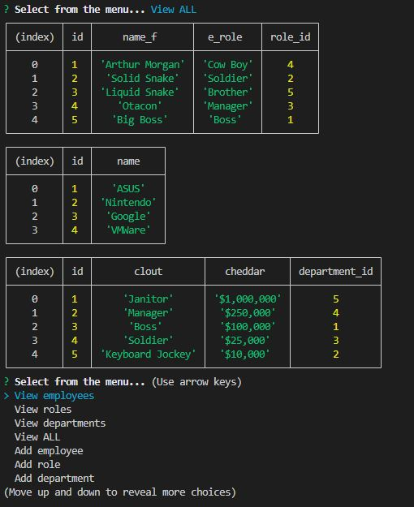

# Employee Tracking with mySQL

An app that allows a user to view, add, update and delete employees, roles and departments.

## Installation

1. Download or Clone this repository.
2. Node.js is required to run this application.
3. MYSQL Workbench is required to run this application.
4. `npm install` in terminal to install all required dependencies.

## Usage

* Use mySQL Workbench using the provided schema.sql and seed.sql to start a local database.

* To invoke this application use this command:

    `npm run start`

* Terminal will show a menu.

* Use `ARROW KEYS` and `ENTER` to navigate menu.

* Make sure to `VIEW ALL` to ensure proper operation.

* You should see this: 

    

   * [Video Demo](https://www.youtube.com/watch?v=or-fxOTCzJk)

## Features

* Javascript
* Node.js
* npm
* MYSQL2
* Inquirer

## License

Copyright (c) BoiledLettuce. All rights reserved.